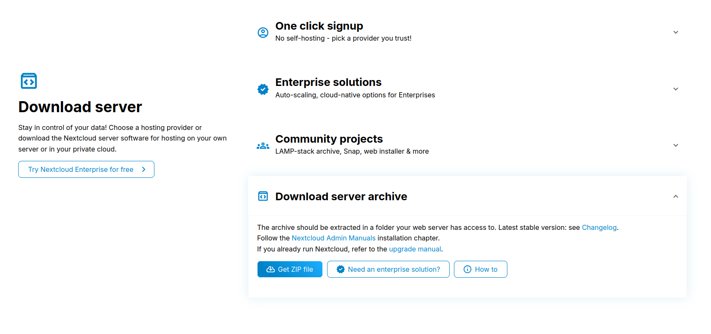

# 🖥️ Documentation Déploiement Nextcloud

**DISCLAIMER** La lecture seule de cette doc ne suffit pas, je traite seulement les sujets complexes ou pas assez détaillé sur le sujet de Mr.WURBEL ou là ou il y a des erreurs dans l'énoncé de Mr.WURBEL. Il faut donc prendre ce document comme un support pour vous avancer

> **Note :** Cette documentation ne couvre pas l'installation des VM, la configuration des IP, etc.

---

## PAS OBLIGATOIRE : 🔌 Connexion aux VM via SSH

Les VM sont dans un réseau non accessible directement depuis le VDI. Pour simplifier les connexions, configurez `~/.ssh/config` comme suit :

```ssh-config
Host webserver1
    HostName 10.20.1.20
    User qamu
    ProxyJump qamu@192.168.122.50

Host webserver2
    HostName 10.20.1.30
    User qamu
    ProxyJump qamu@192.168.122.50

Host redis
    HostName 10.20.1.50
    User qamu
    ProxyJump qamu@192.168.122.50

Host database
    HostName 10.20.1.40
    User qamu
    ProxyJump qamu@192.168.122.50

Host loadbalancer
    HostName 192.168.122.50
    User qamu
```

Avec cette config, `ssh webserver1` fait automatiquement un ProxyJump vers `10.20.1.20`. Sans ça, il faudrait se connecter en deux étapes (d'abord sur le loadbalancer en faisant `ssh qamu@192.168.122.50` puis rebondir en faisant `ssh qamu@10.20.1.20`).

> 💡 **Bonus perf :** copiez votre clé publique du VDI sur chaque VM dans le fichier ~/.ssh/authorized_keys pour éviter de saisir le mot de passe à chaque connexion. (si le fichier n'existe pas créez le)

---

## 📋 Travail à faire

### ✅ Travail 1

> *(Non décrit dans cette documentation)*

---

### ✅ Travail 2 — Configuration MariaDB

#### 1. Installation

```bash
sudo apt install mariadb-server
```

Dans `/etc/mysql/mariadb.cnf`, décommenter la ligne :

```ini
port = 3306
```

#### 2. Configuration serveur

Dans `/etc/mysql/mariadb.conf.d/50-server.cnf` :

```ini
[server]
skip_name_resolve = 1
innodb_buffer_pool_size = 128M
# innodb_buffer_pool_instances = 1
innodb_flush_log_at_trx_commit = 2
innodb_log_buffer_size = 32M
innodb_max_dirty_pages_pct = 90
query_cache_type = 1
query_cache_limit = 2M
query_cache_min_res_unit = 2k
query_cache_size = 64M
tmp_table_size = 64M
max_heap_table_size = 64M
slow_query_log = 1
slow_query_log_file = /var/log/mysql/slow.log
long_query_time = 1

[mariadbd]
character_set_server = utf8mb4
collation_server = utf8mb4_general_ci
transaction_isolation = READ-COMMITTED
binlog_format = ROW
```

Changer également le `bind-address` dans le même fichier :

```ini
bind-address = 0.0.0.0
```

#### 3. Configuration client

Dans `/etc/mysql/mariadb.conf.d/50-client.cnf` :

```ini
[client]
default-character-set = utf8mb4
```

#### 4. Finalisation

```bash
sudo mkdir -p /var/log/mysql/
sudo systemctl restart mariadb
sudo mariadb   # puis copier/coller les commandes SQL de l'énoncé, tout marche nickel normalement
```

---

### ✅ Travail 3 — Serveur NFS (sur `ncc-redis`)

#### 1. Installation

```bash
sudo apt install apache2 nfs-kernel-server
```

> 💡 On installe `apache2` directement pour éviter de recréer `www-data` manuellement.

Désactiver Apache sur `ncc-redis` (il ne doit pas tourner ici) :

```bash
sudo systemctl stop apache2
sudo systemctl disable apache2
```

#### 2. Création du partage NFS

```bash
sudo mkdir -p /srv/nfs/ncshare
```

Dans `/etc/exports` :

```
/srv/nfs/ncshare 10.20.1.20(rw,sync) 10.20.1.30(rw,sync)
```

Appliquer la configuration :

```bash
sudo exportfs -a
```

---

### ✅ Travail 4 — Configuration Redis

Suivre le guide du TP. Ne pas oublier de redémarrer Redis à la fin :

```bash
sudo systemctl restart redis
```

---

### ✅ Travail 5 — Configuration Apache

Je vais pas lister les commandes psk ça va être hyper long mais voici le guide pour tout faire

#### Commandes utiles

| Action | Commande |
|--------|----------|
| Activer un module | `sudo a2enmod [module]` |
| Désactiver un module | `sudo a2dismod [module]` |
| Activer une config | `sudo a2enconf [config]` |
| Désactiver une config | `sudo a2disconf [config]` |

> ℹ️ Si certains modules ou configs n'existent pas, ce n'est pas grave — ils ne sont pas indispensables au fonctionnement du TP.

#### Hôte virtuel Nextcloud

Créer `/etc/apache2/sites-available/nextcloud.conf` :

```apache
# nextcloud virtual host

<VirtualHost *:80>
  DocumentRoot /var/www/nextcloud/
  ServerName  dav.mycloud.net

  <Directory /var/www/nextcloud/>
    Require all granted
    AllowOverride All
    Options FollowSymLinks MultiViews

    <IfModule mod_dav.c>
      Dav off
    </IfModule>
  </Directory>

  ProxyFCGIBackendType FPM
  <FilesMatch remote.php>
    SetEnvIf Authorization "(.*)" HTTP_AUTHORIZATION=$1
  </FilesMatch>

  # Available loglevels: trace8, ..., trace1, debug, info, notice, warn,
  # error, crit, alert, emerg.
  # It is also possible to configure the loglevel for particular
  # modules, e.g.
  #LogLevel info ssl:warn
  ErrorLog ${APACHE_LOG_DIR}/dav-error.log
  CustomLog ${APACHE_LOG_DIR}/dav-access.log vhost_combined

</VirtualHost>
```

Activer le site :

```bash
sudo a2ensite nextcloud
```

> ⚠️ **Cette configuration doit être faite sur les DEUX webservers.**

---

### ✅ Travail 6 — Montage NFS (sur `webserver1` et `webserver2`)

```bash
sudo apt install nfs-common
sudo mkdir -p /srv/nfs/ncshare
```

Ajouter dans `/etc/fstab` :

```fstab
10.20.1.50:/srv/nfs/ncshare /srv/nfs/ncshare nfs rw,bg,intr 0 0
```

Monter le partage :

```bash
sudo mount /srv/nfs/ncshare
```

---

### ✅ Travail 7 — Installation Nextcloud

#### 1. Téléchargement (depuis le VDI)



Aller sur [https://nextcloud.com/install/#download-server](https://nextcloud.com/install/#download-server), télécharger le fichier ZIP, puis l'envoyer sur `webserver1` :


```bash
scp fichier.zip webserver1:
```
Et oui merci le fichier de conf ssh ! ça simplifie la commande scp et webserver1: fait le proxyjump à notre place

#### 2. Installation (sur `webserver1`)

```bash
sudo mv fichier.zip /var/www/
cd /var/www/
unzip fichier.zip
sudo chown -R www-data:www-data nextcloud
```

#### 3. Configuration initiale via OCC

```bash
cd /var/www/nextcloud
sudo -E -u www-data php occ maintenance:install \
     --database 'mysql' \
     --database-name 'nextcloud' \
     --database-host '10.20.1.40' \
     --database-user 'ncc' \
     --database-pass 'le_super_mot_de_passe_déjà_défini' \
     --admin-pass 'mdp_de_admin' \
     --data-dir '/srv/nfs/ncshare'
```

> ⚠️ Remplacer `--database-pass` et `--admin-pass` par les vraies valeurs.  
> ✅ Si tout s'est bien passé, le message `Configuration successful` ou un truc du genre s'affiche.

En cas d'erreur de connexion à la base : vérifier le `bind-address` dans MariaDB et relancer `systemctl restart mariadb`. Sinon force à vous

#### 4. Configuration `config.php`

Comme une config vaut mieux que mille mots. Configuration finale sur `webserver2` (`/var/www/nextcloud/config/config.php`) :

```php
<?php
$CONFIG = array (
  'passwordsalt' => 'y+jASz2Z5rga2oKSnvtgNfdzZMn8bw',
  'secret' => 'q80eBm7JAfV8IDgNoH9H1KlZ8sW/mt+p71Fd+XXjIUdbUUUo',
  'trusted_domains' =>
  array (
	0 => 'localhost',
	1 => 'dav.mycloud.net',
  ),
  'datadirectory' => '/srv/nfs/ncshare',
  'dbtype' => 'mysql',
  'version' => '33.0.0.16',
  'overwrite.cli.url' => 'http://localhost',
  'dbname' => 'nextcloud',
  'dbhost' => '10.20.1.40',
  'dbtableprefix' => 'oc_',
  'mysql.utf8mb4' => true,
  'dbuser' => 'ncc',
  'dbpassword' => 'sousou123',
  'installed' => true,
  'instanceid' => 'ocdakjvf4t5k',
  'memcache.local' => '\\OC\\Memcache\\APCu',
  'memcache.distributed' => '\\OC\\Memcache\\Redis',
  'redis' => [
	'host' => '10.20.1.50',
	'port' => 6379,
	'timeout' => 0.0,
	'read_timeout' => 0.0,
	],
  'trusted_proxies' => ['10.20.1.10', ],
);
```
OULALA J’AI LEAK MON MDP DE MA BDD NOOOOONNNNN !!

#### 5. DNS local sur le loadbalancer

Dans `/etc/hosts` du loadbalancer, ajouter :

```
10.20.1.20    dav.mycloud.net
```

Puis, toujours avec `loadbalancer`, tester avec `curl` ou `wget` :

```bash
curl http://dav.mycloud.net
```
N'oubliez pas de commenter la ligne dans /etc/hosts pour la suite
---

### ✅ Travail 8 — Synchronisation entre webservers

#### 1. Génération des clés SSH (sur `webserver2`, user `ncc`)

```bash
ssh-keygen -t rsa   # Entrée × 3 pour une clé sans passphrase
ssh-copy-id ncc@10.20.1.20
```

#### 2. Restriction SSH (sur `webserver1`)

Dans `/home/ncc/.ssh/authorized_keys`, ajouter **devant** la clé publique de `webserver2` :

```
command="/home/ncc/filtre_ssh.sh",no-port-forwarding,no-X11-forwarding,no-agent-forwarding
```

Créer `/home/ncc/filtre_ssh.sh` :

```bash
#!/bin/bash

case $SSH_ORIGINAL_COMMAND in
    *\|*|*\;*|*\&)
        echo "UNAUTHORIZED COMMAND"
        ;;
    rsync*)
        $SSH_ORIGINAL_COMMAND
        ;;
    sudo\ rsync*)
        $SSH_ORIGINAL_COMMAND
        ;;
    *)
        echo "UNAUTHORIZED COMMAND"
        ;;
esac
```

```bash
chmod +x /home/ncc/filtre_ssh.sh
```

#### 3. Sudo sans mot de passe pour rsync (sur les DEUX webservers)

avec l'utilisateur qamu 

```bash
sudo visudo
```

Ajouter :

```sudoers
ncc     ALL=(root) NOPASSWD: /usr/bin/rsync
```

#### 4. Script de synchronisation (sur `webserver2`, user `ncc`)

Créer `/home/ncc/synchro.sh` :

```bash
#!/bin/bash
sudo rsync -avz -e 'ssh -l ncc -i /home/ncc/.ssh/id_rsa' \
    --rsync-path="sudo rsync" \
    10.20.1.20:/var/www/nextcloud /var/www >> /home/ncc/log/synchro.log
```

```bash
chmod +x /home/ncc/synchro.sh
```

Ajouter la tâche cron :

```bash
crontab -e
```

```cron
*/30 * * * * /home/ncc/synchro.sh
```

---

### ✅ Travail 9 — Configuration HAProxy

Suivre le TP (lecture + copier/coller). Ne pas oublier de redémarrer HAProxy :

```bash
sudo systemctl restart haproxy
```

---

### ✅ Travail 10 — Test depuis la machine cliente

Sur la machine Debian cliente (moi j'ai pris celle de JLD), ajouter dans `/etc/hosts` :

```
192.168.122.50    dav.mycloud.net
```
Puis ouvrez Firefox et allez sur l'URL `http://dav.mycloud.net`

Suivre le TP et surveiller les logs Apache en temps réel :

```bash
tail -f /var/log/apache2/dav-access.log
```
